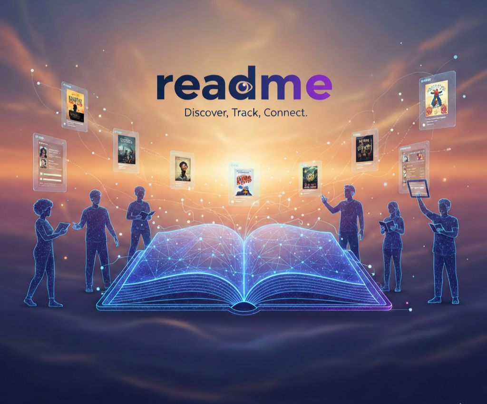

# PROJE ADI

**ReadMe**

---

## Proje Hakkında

**Proje Tanımı:** 
ReadMe akıllı kütüphane ve sosyal ağ platformumuz, kitap keşfetme ve okuma takibi deneyimini yenilikçi ve keyifli bir hale getirmek için tasarlandı. Geniş kitap arşivimiz sayesinde, aradığınız kitap ve yazarları kolayca bulabilirken, kullanıcı dostu arayüzümüzle kendi dijital raflarınızı dilediğiniz gibi yönetebilirsiniz. Detaylı kitap incelemeleri, puanlama sistemleri ve diğer kitapseverlerle etkileşime geçebileceğiniz sosyal yapımızla, okurların beklentilerini en üst seviyede karşılamayı ve kesintisiz bir deneyim sunmayı hedefliyoruz. Yeni nesil kitap platformumuz ReadMe'ye hoş geldiniz, size yeni dünyaların kapılarını aralamak için sabırsızlanıyoruz.

**Proje Kategorisi:** 
Kitap İnceleme ve Sosyal Paylaşım Platformu

**Referans Uygulama:** 
[Referans Uygulama (goodreads)](https://www.goodreads.com)

---

## Proje Linkleri

- **REST API Adresi:** [api.yazmuh.com](https://api.yazmuh.com)
- **Web Frontend Adresi:** [frontend.yazmuh.com](https://frontend.yazmuh.com)

---

## Proje Ekibi

**Grup Adı:** 
TrioReads

**Ekip Üyeleri:** 
- Elif Gül Uyar
- Verda Er
- Efsa Nur Bölükbaş

---

## Dokümantasyon

Proje dokümantasyonuna aşağıdaki linklerden erişebilirsiniz:

1. [Gereksinim Analizi](Gereksinim-Analizi.md)
2. [REST API Tasarımı](API-Tasarimi.md)
3. [REST API](Rest-API.md)
4. [Web Front-End](WebFrontEnd.md)
5. [Mobil Front-End](MobilFrontEnd.md)
6. [Mobil Backend](MobilBackEnd.md)
7. [Video Sunum](Sunum.md)

---
